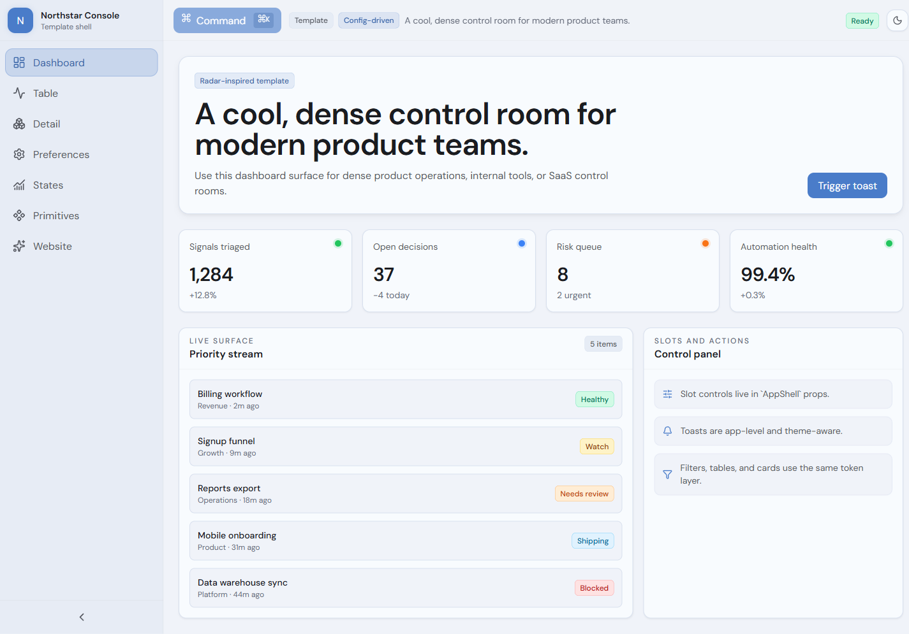
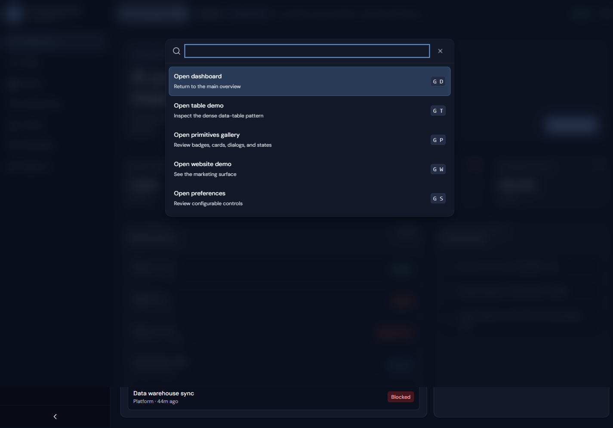
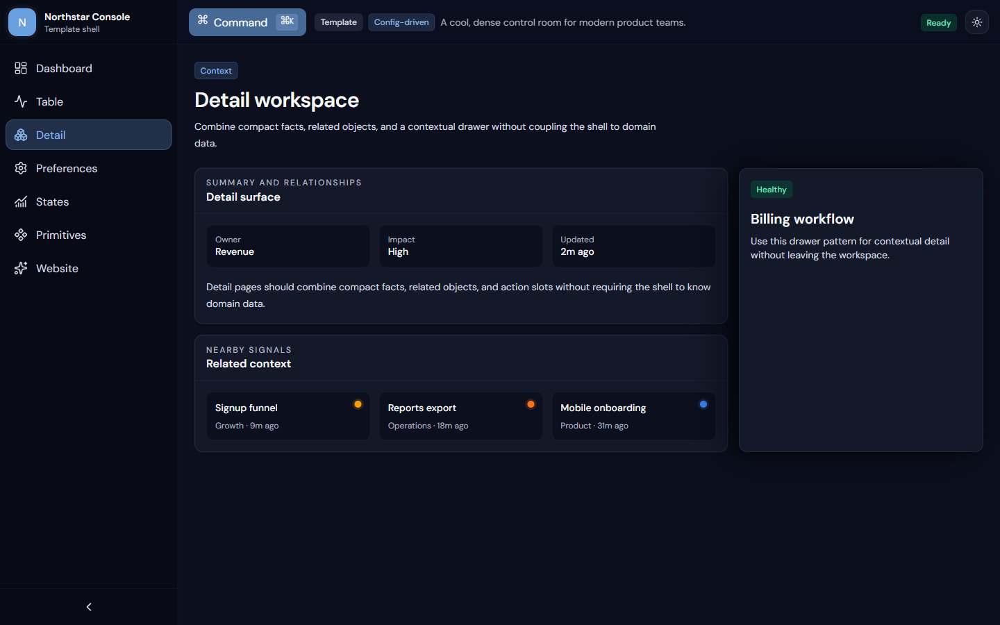
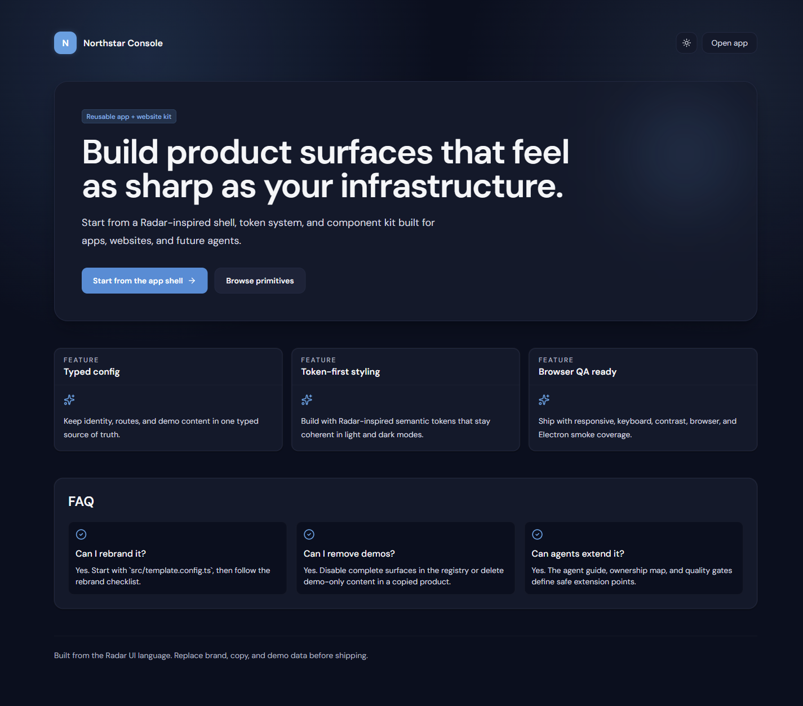

# Radar UI Template

A production-ready React, Vite, Tailwind CSS, and Electron template for cool, data-dense control rooms, internal tools, and desktop apps.

[](LICENSE)
[](https://react.dev/)
[](https://www.typescriptlang.org/)
[](https://www.electronjs.org/)

> [!IMPORTANT]
> This independent template is inspired by [Radar](https://github.com/skyhook-io/radar), Skyhook's open-source Kubernetes visibility tool. Radar's visual language and engineering discipline are the foundation for this project. This repository is not the official Radar application and is not maintained by Skyhook.



## Why this template

- **One typed customization source** for identity, website copy, routes, navigation, commands, metrics, and demo data.
- **Browser and desktop delivery** from the same React source, including safe Electron `file://` hash routing.
- **Radar-inspired design system** with light/dark themes, semantic tokens, dense tables, cards, dialogs, states, and responsive app chrome.
- **Agent-ready documentation** through `AGENTS.md`, `DESIGN.md`, ownership maps, extension recipes, and executable quality gates.
- **Production-minded defaults**: strict TypeScript 7, accessible keyboard flows, Electron sandboxing, package-consumer smoke tests, portable builds, and an NSIS installer.

## Quick start

Requirements: Node.js 22.12 or newer and npm.

```bash
git clone https://github.com/sm18lr88/radar-UI-template.git
cd radar-UI-template
npm install
npm run dev
```

Open the local Vite URL, then start adapting `src/template.config.ts`.

## Command-first navigation

The command palette uses a modal combobox/listbox interaction with Arrow, Home, End, Enter, Escape, focus containment, and focus restoration.



## Customize without configuration drift

`src/template.config.ts` is the first edit for a new product. Surface identity, enabled state, navigation, and command metadata stay together:

```ts
surfaces: defineSurfaceRegistry({
  defaultRoute: '/app',
  routes: {
    '/app': {
      enabled: true,
      nav: {
        order: 0,
        id: 'dashboard',
        label: 'Dashboard',
        icon: LayoutDashboard,
        description: 'Operational overview and trend cards',
      },
      command: {
        order: 0,
        id: 'open-dashboard',
        label: 'Open dashboard',
        description: 'Return to the main overview',
        keywords: ['home', 'overview'],
      },
    },
  },
})
```

Set `enabled: false` once and the route disappears from route validation, navigation, and commands together. Page rendering remains explicit in `src/App.tsx`; the registry does not own components, loaders, permissions, or runtime state.

## Detail and operational surfaces

The included screens demonstrate constrained content width, summary facts, related context, semantic status, responsive tables, feedback states, settings flows, and public composition primitives.



Included routes:

| Route | Pattern |
| --- | --- |
| `/app` | Dashboard and metric overview |
| `/app/table` | Dense responsive table and filters |
| `/app/detail` | Summary, related context, and detail panel |
| `/app/preferences` | Accessible settings dialog |
| `/app/states` | Loading, empty, success, and error feedback |
| `/primitives` | Public component gallery |
| `/site` | Standalone website surface |

## App and website from one token system

The website demo uses the same brand configuration, theme provider, semantic colors, typography, badges, cards, and responsive rules as the application shell.



## Public composition API

Import supported components and named prop/context types from the package root:

```tsx
import {
  AppShell,
  Badge,
  CommandPalette,
  Dialog,
  PageHeader,
  TemplateProviders,
} from 'radar-ui-template'
import 'radar-ui-template/style.css'
```

`src/index.ts` is the public allowlist. Demo pages, routing transport, modal internals, scripts, and the Electron main process remain private implementation surfaces.

## Browser and desktop commands

| Goal | Command |
| --- | --- |
| Start Vite | `npm run dev` |
| Typecheck with TypeScript 7 | `npm run tsc` |
| Build browser assets | `npm run build` |
| Run browser smoke tests | `npm run smoke` |
| Launch Electron | `npm run desktop` |
| Run Electron lifecycle smoke | `npm run desktop:smoke` |
| Build Windows portable executable | `npm run desktop:pack` |
| Build Windows NSIS installer | `npm run desktop:installer` |
| Install, exercise, and uninstall | `npm run desktop:install-smoke` |
| Validate detached source copy | `npm run copy-smoke` |
| Validate packed public API | `npm run package-smoke` |

Browser builds use `/` asset paths. Desktop builds use `./` assets and hash routes so Electron can load `dist/index.html` securely over `file://`.

## Project map

```text
src/
  components/       public primitives, shell, command, and providers
  demo/             replaceable example screens
  theme/            CSS variables and Tailwind v4 token mapping
  App.tsx            explicit route rendering
  surface-registry.ts typed route/nav/command projections
  template.config.ts identity, website copy, surfaces, and demo data
electron/            sandboxed desktop main process
scripts/             build, package, install, copy, and consumer smokes
docs/                agent contracts, recipes, and quality gates
```

Start with:

1. [`AGENTS.md`](AGENTS.md) for editing rules and verification commands.
2. [`DESIGN.md`](DESIGN.md) for the visual and interaction contract.
3. [`docs/rebrand-checklist.md`](docs/rebrand-checklist.md) for adaptation order.
4. [`docs/extension-recipes.md`](docs/extension-recipes.md) for routes, commands, primitives, and packaging.
5. [`docs/quality-gates.md`](docs/quality-gates.md) before shipping.

## Security and accessibility defaults

- Electron sandbox and context isolation enabled; Node integration disabled.
- New windows, webviews, external navigation, and renderer permissions denied.
- Parsed local-file navigation allowlist.
- Native modal dialogs with Escape, backdrop close, focus trap, and focus return.
- Command palette combobox/listbox semantics and IME-safe keyboard handling.
- Semantic light/dark contrast checks and responsive browser coverage.
- No runtime cloud service, account, analytics, or backend dependency.

## Attribution

This project exists because of [Skyhook's Radar](https://github.com/skyhook-io/radar). Radar is a modern, local-first Kubernetes visibility tool and is the original source of the cool blue-neutral control-room aesthetic that inspired this template.

Please visit, use, and support the original project:

- Repository: [github.com/skyhook-io/radar](https://github.com/skyhook-io/radar)
- Website: [radarhq.io](https://radarhq.io)
- Maintainer: [Skyhook](https://skyhook.io)

No Radar product code, Kubernetes backend, or private service dependency is included here. Attribution and the Apache 2.0 license are retained.

## License

Apache 2.0. See [`LICENSE`](LICENSE).
